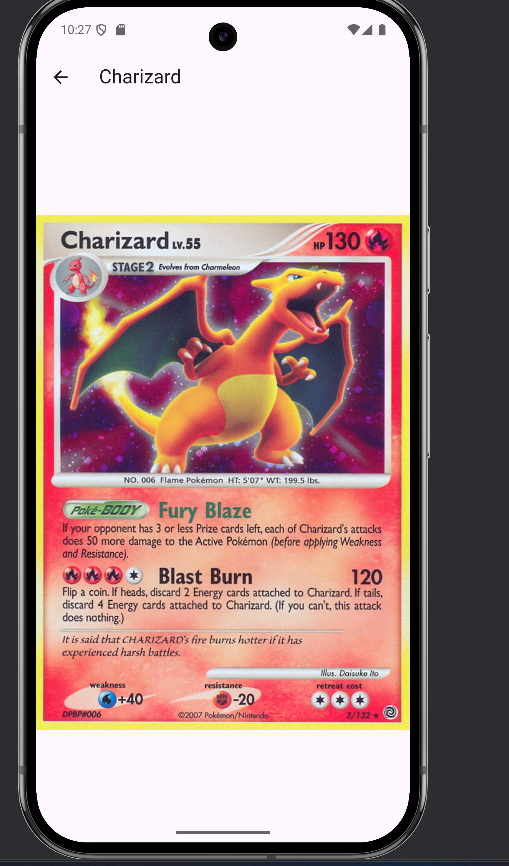

# lab4

This is the  initial image of flutter app

This is the flutter project of making a pokemon card app.  In this project a flutter application
fetches Pokemon card data from an API and displays it in a scrollable list.
So, Here in this i have add https/ dependendices in a pubspec.yaml section.
Also, I have add a "search feature" in a app where users can filter Pokemon cards by name 
and view detailed images of each card.

Features
1. Fetches Pokémon card data from the API 
2. Displays a scrollable list of Pokémon cards  
3. Implements a search function to filter Pokémon by name  
4. Shows detailed Pokémon images on a new screen when a card is clicked  
5. Uses ListView.builder for efficient rendering

Technologies Used
- Flutter: Framework for building cross-platform mobile applications.
- Dart: Programming language used to develop the application.
- http: Library for handling API requests.
- Material Design: Provides a modern UI layout.
 
Explantion of code
main.dart
- PokemonApp Class: Entry point of the application. It sets up the MaterialApp.
- PokemonListScreen StatefulWidget: Handles fetching and displaying Pokémon cards.
- Fetching Data: Uses the http package to retrieve data from the Pokémon TCG API.
- Search Functionality: Filters the list of Pokémon cards based on user input.

  Navigation:
- ListTitle displays Pokémon names and images.
- Clicking on a Pokémon navigates to DetailScreen to show a larger image.
- DetailScreen: Displays a full-size image of the selected Pokémon card.

## Getting Started

This project is a starting point for a Flutter application.

A few resources to get you started if this is your first Flutter project:

- [Lab: Write your first Flutter app](https://docs.flutter.dev/get-started/codelab)
- [Cookbook: Useful Flutter samples](https://docs.flutter.dev/cookbook)

For help getting started with Flutter development, view the
[online documentation](https://docs.flutter.dev/), which offers tutorials,
samples, guidance on mobile development, and a full API reference.
